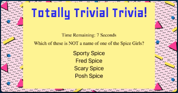

TriviaGame
==========

UCF Full Stack Developer Bootcamp, Week 3 homework

Build a trivia game on the topic(s) of your own choosing. Begin the process of
segregating HTML from CSS from images, etc. as a step towards professional
standards of project construction. For example, now using app.js, style.css &
index.js instead of cramming everything into index.html.

Among the challenges here was to decide how to structure how the questions,
answer choices and correct answer were stored. This decision obviously impacted
how to extract the info & then display the info. The actual logic to run the
game was quite simple. My biggest challenge was trying to master the syntax for
some of the commands.

Naturally, the subject I chose was rugby. I wrote the questions so that users
would recognize most of the names since they were famous in other major sports.
Generally, the pick out the right answer as the one option showing a name, place
or other term they maybe heard only rarely, if at all…

In what had already become standard practice for me on these projects, the focus
was on getting it working with some code commenting embedded, then formatting,
then more comprehensive comments & finally the README.

I developed an analogy comparing the submission of these assignments to a hockey
goalie. When the puck gets past the goalie, he has block that from his mind and
move on… because there is another puck coming right behind it. In this case,
once the deadline hits, the previous homework assignment is a puck already
laying in my net. I can’t afford to spend any more time on it ..because there is
another homework assignment … with another tight deadline… coming right at me.

One consolation I find as I go back to clean up these projects is that coding is
sometimes quite easy. Fixing /improving /fine-tuning the project is much easier
/faster than what I remember when I was trying to finish it at the deadline…

Here are the Original Homework Instructions:

JavaScript Assignment 2
=======================

### Overview

In this assignment, you’ll create a Trivia game using JavaScript for the logic
and jQuery to manipulate HTML. Be sure to layout this app with valid HTML and
stylish CSS.

### Before You Begin

1.  Create a GitHub repo called `TriviaGame`, then clone the repo to your
    computer.

2.  Create a file inside of the `TriviaGame` folder called `index.html`. This is
    where you'll mark up all of your HTML.

3.  Don't forget to include a script tag with the jQuery library.

4.  Create a folder inside of the `TriviaGame` folder called `assets`.

5.  Inside `assets`, create three folders: `css`, `javascript`, `images`

-   In your `css` folder, create a `style.css` file.

-   In your `javascript` folder, create an `app.js` file; here you'll write all
    of your JavaScript and jQuery.

-   In your `images` folder, save whatever images you'd like to use in this
    exercise.

1.  Choose a game to build from your options below.

### Option One: Basic Quiz (Timed Form)

Basic

[Click Here to Watch the Demo](basic-trivia-demo.mov).

-   You'll create a trivia form with multiple choice or true/false options (your
    choice).

-   The player will have a limited amount of time to finish the quiz.

-   The game ends when the time runs out. The page will reveal the number of
    questions that players answer correctly and incorrectly.

-   Don't let the player pick more than one answer per question.

-   Don't forget to include a countdown timer.

### Option Two: Advanced Assignment (Timed Questions)

Advanced

[Click Here to Watch the demo](advanced-trivia-demo.mov).

-   You'll create a trivia game that shows only one question until the player
    answers it or their time runs out.

-   If the player selects the correct answer, show a screen congratulating them
    for choosing the right option. After a few seconds, display the next
    question -- do this without user input.

-   The scenario is similar for wrong answers and time-outs.

-   If the player runs out of time, tell the player that time's up and display
    the correct answer. Wait a few seconds, then show the next question.

-   If the player chooses the wrong answer, tell the player they selected the
    wrong option and then display the correct answer. Wait a few seconds, then
    show the next question.

-   On the final screen, show the number of correct answers, incorrect answers,
    and an option to restart the game (without reloading the page).

### Minimum Requirements

Attempt to complete homework assignment as described in instructions. If unable
to complete certain portions, please pseudocode these portions to describe what
remains to be completed. Adding a README.md as well as adding this homework to
your portfolio are required as well and more information can be found below.

### Create a README.md

Add a `README.md` to your repository describing the project. Here are some
resources for creating your `README.md`. Here are some resources to help you
along the way:

-   [About READMEs](https://help.github.com/articles/about-readmes/)

-   [Mastering Markdown](https://guides.github.com/features/mastering-markdown/)

### Add To Your Portfolio

After completing the homework please add the piece to your portfolio. Make sure
to add a link to your updated portfolio in the comments section of your homework
so the TAs can easily ensure you completed this step when they are grading the
assignment. To receive an 'A' on any assignment, you must link to it from your
portfolio.

### A Few Last Notes

-   Styling and theme are completely up to you. Get creative!

-   Remember to deploy your assignment to Github Pages.

\*If you have any questions about this project or the material we have covered,
please post them in the community channels in slack so that your fellow
developers can help you! If you're still having trouble, you can come to office
hours for assistance from your instructor and TAs.

**Good Luck!**
